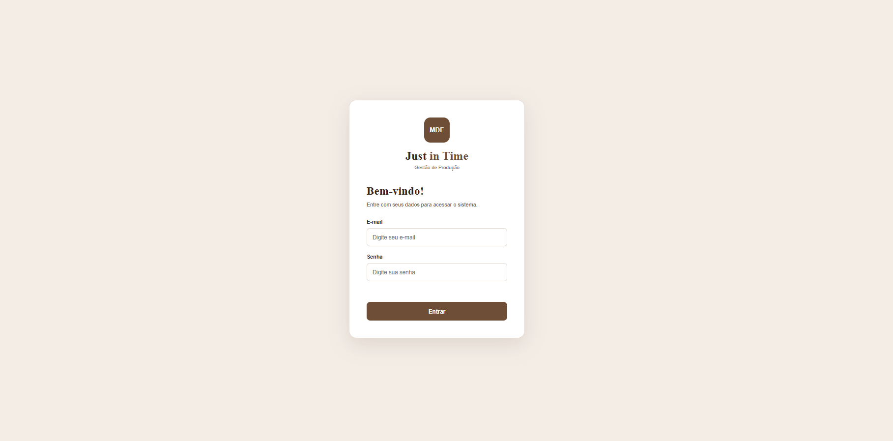
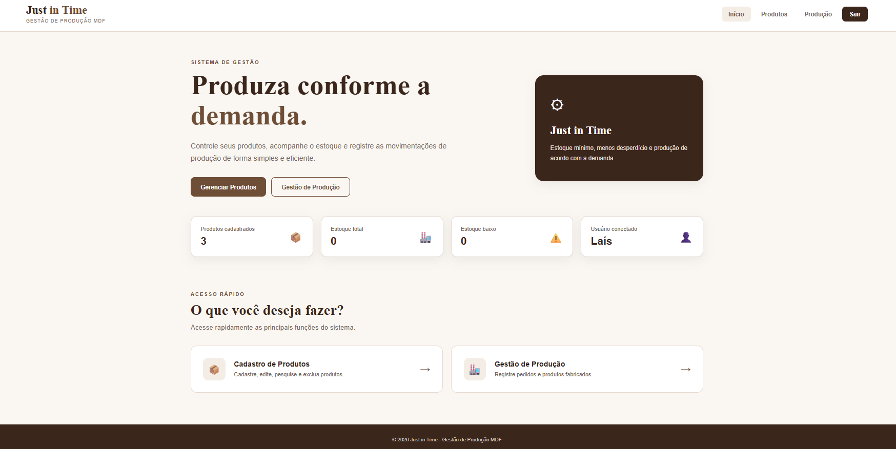
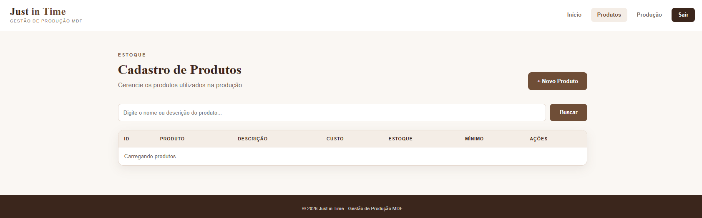
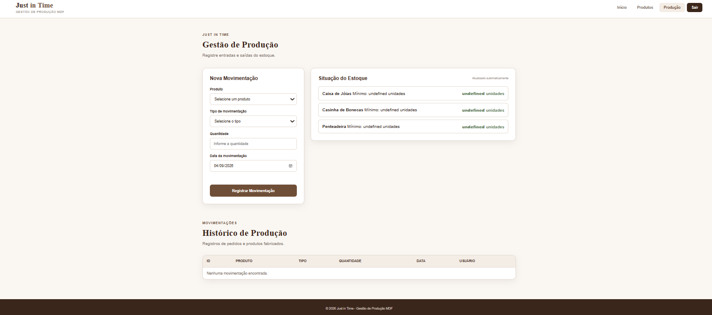

# 🏭 Just in Time

Sistema web desenvolvido para gerenciamento de produtos, estoque, pedidos e produção de uma empresa fabricante de produtos em MDF.

Projeto desenvolvido para a **Preparação SAEP 2026 – SENAI**.

---

## 📋 Sobre o projeto

O sistema tem como objetivo auxiliar uma empresa fabricante de produtos em MDF no controle de sua produção e estoque, utilizando o conceito de **Just in Time (JIT)**.

A aplicação permite controlar:

- 🔐 Autenticação de usuários
- 📦 Cadastro de produtos
- 📝 Pedidos
- 🏭 Produção
- 📊 Estoque
- ⚠️ Estoque mínimo
- 👤 Usuário responsável por cada movimentação

O sistema busca reduzir erros e atrasos causados pelo processo manual de controle de pedidos e produção.

---

## 🎯 Objetivo

Desenvolver um sistema **Full Stack Web** capaz de:

- Controlar o cadastro de produtos;
- Controlar entradas e saídas de estoque;
- Registrar pedidos;
- Registrar produtos fabricados;
- Controlar o estoque mínimo;
- Alertar quando o estoque estiver abaixo do mínimo;
- Identificar o usuário responsável por cada movimentação;
- Auxiliar no planejamento da produção conforme a demanda.

---


###  Autenticação

- Login com e-mail e senha;
- Validação das credenciais;
- Bloqueio de acesso às páginas internas sem autenticação;
- Logout;
- Redirecionamento para a tela de login.

### 📦 Cadastro de Produtos

- Listagem de produtos;
- Pesquisa por produto;
- Cadastro de novos produtos;
- Edição de produtos;
- Exclusão de produtos;
- Controle de estoque atual;
- Controle de estoque mínimo.

### 🏭 Gestão de Produção e Estoque

- Listagem dos produtos em ordem alfabética;
- Registro de produtos fabricados;
- Registro de pedidos;
- Entrada de estoque através da produção;
- Saída de estoque através dos pedidos;
- Registro da quantidade movimentada;
- Registro da data;
- Identificação do usuário responsável;
- Alerta de estoque abaixo do mínimo.

---

## 🔄 Funcionamento do JIT

```text
             PEDIDO
                │
                ▼
        ┌───────────────┐
        │ Saída estoque │
        └───────┬───────┘
                │
                ▼
       Estoque abaixo
        do mínimo?
          │       │
         SIM     NÃO
          │       │
          ▼       ▼
     PRODUÇÃO   Acompanhar
          │
          ▼
    Entrada estoque
          │
          ▼
      Estoque atualizado


```` 
### Estrutura do projeto
````git hub
Just-in-Time/
│
├── backend/
│   ├── src/
│   │   ├── controllers/
│   │   ├── routes/
│   │   └── server.js
│   │
│   ├── prisma/
│   │   ├── schema.prisma
│   │
│   ├── package.json
│   └── .env
│
├── frontend/
│   ├── index.html
│   ├── css/
│   └── js/
│
└── README.md
```git hub


````
### Schema.Prisma

````generator client {
  provider = "prisma-client-js"
}

datasource db {
  provider = "mysql"
}

model Usuario {
  id        Int        @id @default(autoincrement())
  nome      String
  email     String     @unique
  senha     String
  perfil    String
  producoes Producao[]
}

model Produto {
  id                 Int        @id @default(autoincrement())
  nome               String
  descricao          String?
  custo              Decimal    @db.Decimal(10, 2)
  quantidade_estoque Int
  estoque_minimo     Int
  producoes          Producao[]
}

model Producao {
  id                Int      @id @default(autoincrement())
  tipo              String
  quantidade        Int
  data_movimentacao DateTime
  produtoId         Int
  usuarioId         Int

  produto Produto @relation(fields: [produtoId], references: [id])
  usuario Usuario @relation(fields: [usuarioId], references: [id])
}

````git hub


````
### Evidências do Frontend 
  - > Tela 1


- > Tela 2 


- > Tela 3

  
- > Tela 4



### Projeto acadêmico
- > Projeto desenvolvido como parte da Preparação SAEP 2026 – SENAI.
  

AUTORA: Lívia Mazzolini Guarizo
